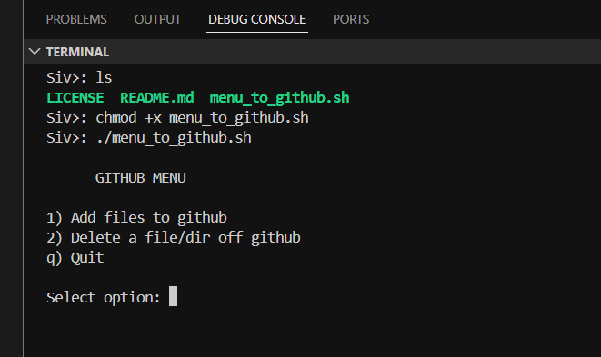

# GitHub CLI Menu Automation (Bash)

A lightweight, menu-driven Bash script that automates common GitHub workflows directly from the terminal.  
Designed for developers who prefer speed, safety, and consistency over manual Git commands or GUI tools.

This script reduces human error while keeping full control of Git history and branches.

---

## Features

- Interactive terminal menu
- Add and push files to GitHub
- Safely delete files or directories from GitHub
- Automatic branch detection
- Built-in safety confirmations
- No force pushes
- No GUI dependencies

  

---

## Menu Options

### 1. Add Files to GitHub

This option guides you through a controlled add–commit–push workflow.

What it does:
- Lists all files in the current directory (excluding `.git`)
- Allows selecting a single file or staging all files
- Automatically detects the active Git branch
- Pulls the latest changes from the remote branch
- Prompts for a commit message
- Commits and pushes to the same branch

This prevents pushing to the wrong branch or missing upstream changes.

---

### 2. Delete Files or Directories (Safe Mode)

This option removes files or folders from both the local repository and GitHub using `git rm`.

Safety measures:
- Confirms the target exists
- Requires a commit message
- Displays a clear warning
- Requires an exact confirmation phrase before deletion

All deletions are tracked in Git history and can be recovered if needed.

---

## Why This Script Exists

- Reduce repetitive Git commands
- Prevent accidental deletions or pushes
- Enforce disciplined Git workflows
- Speed up daily development tasks
- Stay fully CLI-based and automation-friendly

This is built for engineers who value correctness over convenience.

---

## Requirements

- Linux or macOS
- Bash
- Git installed and configured
- An initialized Git repository
- A configured remote repository (GitHub, GitLab, etc.)

---

## Usage

- Place the script inside a Git repository
- Make it executable
- Run it from the terminal
- Follow the interactive menu prompts

The script always operates on the currently checked-out branch.

---

## Safety Notes

- Deletions remove files locally and from the remote repository
- No destructive Git operations like `force push`
- All changes remain in Git history
- Always review prompts before confirming actions

---

## Best Practices

- Use meaningful commit messages
- Pull frequently to avoid conflicts
- Run only inside repositories you understand
- Treat Git history as a source of truth
- Avoid running in production repos without review

---

## Future Improvements

- Dry-run mode
- Branch selection inside the menu
- Support for multiple remotes
- Commit message templates
- Colored terminal output
- Optional logging

---

## License

Free to use, modify, and adapt for personal or educational purposes.
